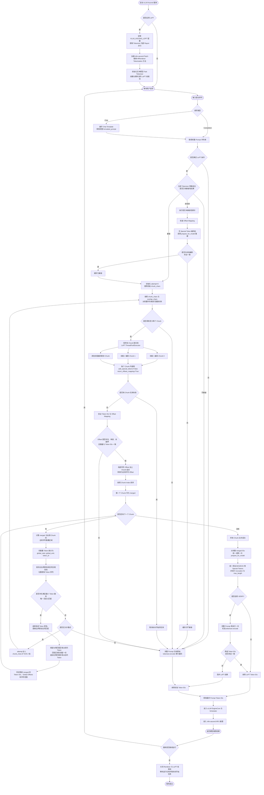

# LoPT 超长序列处理完整流程图

```mermaid
flowchart TD
    START([启动 vLLM Ascend 服务])
    ENV{是否启用 LoPT}
    CONFIG[读取 VLLM_ASCEND_LOPT 配置<br/>限制 Tokenizer 内部 Rayon 并行]
    PATCH[加载 vllm-ascend Patch<br/>替换 HfRenderer Tokenization 方法]
    INIT[初始化文本模型 Fast Tokenizer<br/>创建长期存活的 LoPT 线程池]
    READY([等待用户请求])

    START --> ENV
    ENV -- 否 --> READY
    ENV -- 是 --> CONFIG --> PATCH --> INIT --> READY

    READY --> INPUT([输入超长序列])
    INPUT --> TYPE{请求类型}
    TYPE -- Completion --> PROMPT[取得完整 Prompt 字符串]
    TYPE -- Chat --> TEMPLATE[展开 Chat Template<br/>得到完整 formatted_prompt]
    TEMPLATE --> PROMPT

    PROMPT --> ELIGIBLE{是否满足 LoPT 条件}
    ELIGIBLE -- 否 --> STANDARD[完整 Prompt 交给原始<br/>tokenizer.encode 串行编码]
    ELIGIBLE -- 是 --> PROBE_CACHE{当前 Tokenizer 参数组合<br/>是否已有兼容性结果}

    PROBE_CACHE -- 不兼容 --> STANDARD
    PROBE_CACHE -- 兼容 --> ATTEMPT[初始化 attempt=0<br/>使用初始 chunk_chars]
    PROBE_CACHE -- 未检测 --> PROBE[执行短文本兼容性探针]
    PROBE --> PROBE_OFFSET[检查 Offset Mapping]
    PROBE_OFFSET --> PROBE_REBUILD[无 Special Token 编码后<br/>调用 prepare_for_model 重建]
    PROBE_REBUILD --> PROBE_COMPARE{是否与标准编码<br/>完全一致}
    PROBE_COMPARE -- 否 --> CACHE_BAD[缓存为不兼容] --> STANDARD
    PROBE_COMPARE -- 是 --> CACHE_GOOD[缓存为兼容] --> ATTEMPT

    ATTEMPT --> SPLIT[按照 chunk_chars 与 overlap_chars<br/>对完整字符串进行重叠切块]
    SPLIT --> CHUNKS{是否得到至少两个 Chunk}
    CHUNKS -- 否 --> STANDARD
    CHUNKS -- 是 --> SUBMIT[将所有 Chunk 提交到<br/>LoPT ThreadPoolExecutor]

    SUBMIT --> C0[线程 1 编码 Chunk 0]
    SUBMIT --> C1[线程 2 编码 Chunk 1]
    SUBMIT --> CN[其他线程编码剩余 Chunk]

    C0 --> ENCODE_RULE
    C1 --> ENCODE_RULE
    CN --> ENCODE_RULE

    ENCODE_RULE[每个 Chunk 均使用<br/>add_special_tokens=False<br/>return_offsets_mapping=True]
    ENCODE_RULE --> FUTURE{是否有 Chunk 任务失败}
    FUTURE -- 是 --> CANCEL[取消尚未开始的任务] --> STANDARD
    FUTURE -- 否 --> VALIDATE[验证 Token IDs 与 Offset Mapping]

    VALIDATE --> VALID{Offset 是否存在、单调、未越界<br/>且数量与 Token IDs 一致}
    VALID -- 否 --> STANDARD
    VALID -- 是 --> GLOBAL[局部字符 Offset 加上 Chunk 起点<br/>转换为全局字符 Offset]
    GLOBAL --> SORT[按照 Chunk Index 排序]
    SORT --> MERGED[第一个 Chunk 作为 merged]

    MERGED --> NEXT{是否还有下一个 Chunk}
    NEXT -- 有 --> REGION[计算 merged 与右侧 Chunk 的<br/>全局字符重叠区域]
    REGION --> RECORD[将重叠 Token 表示为<br/>global_start, global_end, token_id]
    RECORD --> MATCH[查找左右两侧连续且完全相同的<br/>位置感知 Token 序列]

    MATCH --> FOUND{是否存在满足最小 Token 数的<br/>唯一无歧义匹配}
    FOUND -- 否 --> RETRY{是否还允许重试}
    RETRY -- 是 --> DOUBLE[attempt 加 1<br/>chunk_chars 扩大为 2 倍] --> SPLIT
    RETRY -- 否 --> STANDARD

    FOUND -- 是 --> SELECT[选择连续 Token 更多、<br/>距离边界更安全的匹配]
    SELECT --> MERGE[保留左侧匹配区域以前的 Token<br/>匹配区域仅保留一份<br/>追加右侧匹配区域以后的 Token]
    MERGE --> UPDATE[同步更新 merged 的<br/>Token IDs、Global Offsets 和字符范围]
    UPDATE --> NEXT

    NEXT -- 没有 --> PREPARE[所有 Chunk 合并成功]
    PREPARE --> FINALIZE[对完整 merged IDs<br/>统一调用一次 prepare_for_model]
    FINALIZE --> SPECIAL[统一添加 BOS/EOS 等 Special Tokens<br/>并执行 truncation 与 max_length]
    SPECIAL --> VERIFY{是否启用 VERIFY}

    VERIFY -- 否 --> LOPT_RESULT[采用 LoPT Token IDs]
    VERIFY -- 是 --> VERIFY_STANDARD[完整 Prompt 再执行一次<br/>标准 tokenizer.encode]
    VERIFY_STANDARD --> SAME{两组 Token IDs<br/>是否完全一致}
    SAME -- 是 --> LOPT_RESULT
    SAME -- 否 --> DISCARD[丢弃 LoPT 结果] --> STANDARD_RESULT

    STANDARD --> STANDARD_RESULT[采用标准 Token IDs]
    LOPT_RESULT --> OUTPUT[得到最终 Prompt Token IDs]
    STANDARD_RESULT --> OUTPUT

    OUTPUT --> ENGINE[进入 vLLM EngineCore 与 Scheduler]
    ENGINE --> NPU[进入 vllm-ascend NPU 推理]
    NPU --> RESULT([返回模型推理结果])

    RESULT --> CONTINUE{服务是否继续运行}
    CONTINUE -- 是 --> READY
    CONTINUE -- 否 --> SHUTDOWN[关闭 Renderer 与 LoPT 线程池<br/>等待运行任务并取消未开始任务]
    SHUTDOWN --> END([服务退出])
```
